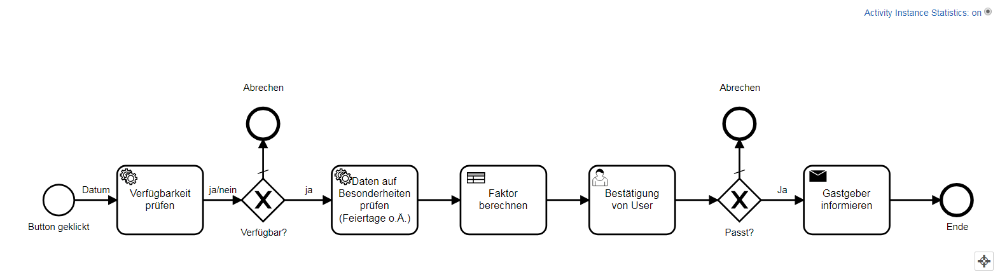

# BPMN Implementierung - Reservierung von Apartment

In dieser Dokumentation ist beschrieben, wie wir das Process der Apartment-Reservierung implementiert haben. Als Beispiel haben wir eigene Webseite (foliage Apartment) entwickelt, wo die Gastgeber Ihre Apartments anbieten. Bei der Implementierung des Processes wurden die folgenden Technologien verwendet:

   * Apache WebServer
   * Tomcat WebServer
   * CakePHP
   * MySQL Datenbank
   * Maven und Plugin shade https://github.com/apache/maven-shade-plugin
   * Camunda https://github.com/camunda/camunda-bpm-platform
   * Google Gson https://github.com/google/gson
   * RestAPI für Feiertage https://feiertage-api.de
   * J2EE, Java SE 1.8
   * Git als Version Control System
   * Bootstrap, Fontawesome und GoogleFonts für das Design 
    
Das Model wurde in Camunda Modeler gemacht. Dies besteht aus zwei Services (extern implementiert), einem DMN (extern implementiert), einem UserTask (wird durch API Aufruf erledigt) und einem SendTask (extern implementiert mit javax.mail). 

