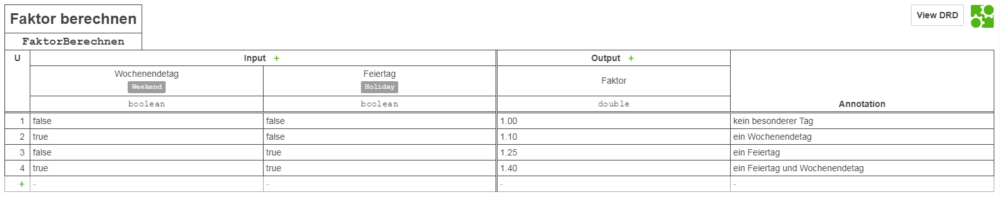
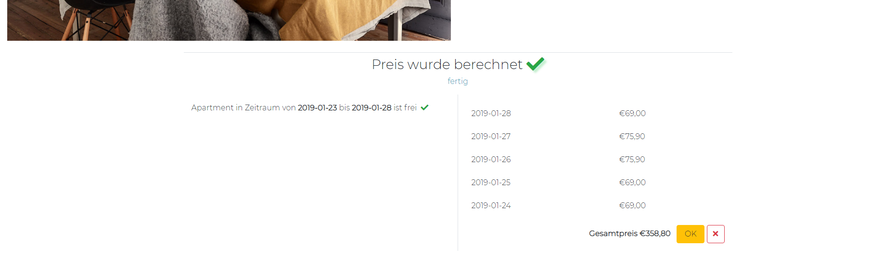
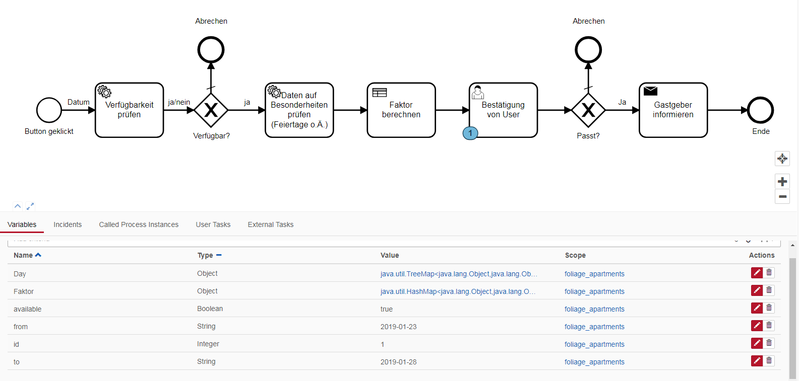

# BPMN Implementierung - Reservierung von Apartment

In dieser Dokumentation ist beschrieben, wie wir das Process der Apartment-Reservierung implementiert haben. Als Beispiel haben wir eigene Webseite (foliage Apartment) entwickelt, wo die Gastgeber Ihre Apartments anbieten. Bei der Implementierung des Processes wurden die folgenden Technologien verwendet:

   * Apache WebServer
   * Tomcat WebServer
   * CakePHP
   * MySQL Datenbank
   * Maven und Plugin shade https://github.com/apache/maven-shade-plugin
   * Camunda https://github.com/camunda/camunda-bpm-platform
   * Google Gson https://github.com/google/gson
   * RestAPI für Feiertage https://feiertage-api.de
   * J2EE, Java SE 1.8
   * Git als Version Control System
   * Bootstrap, Fontawesome und GoogleFonts für das Design 
    
# Modellierung. Camunda
Das Model wurde in Camunda Modeler gemacht. Dies besteht aus zwei Services (extern implementiert), einem DMN (extern implementiert), einem UserTask (wird durch API Aufruf erledigt) und einem SendTask (extern implementiert mit javax.mail).


# Idee. Dynamische Preise

Das Process soll die Preise für Apartments dynamisch berechnen. Die Berechnung geschieht basierend auf Grundpreis (ab *[num]* EUR) und auf den Tagen, auf die das Apartment reserviert wird. Je nach dem, ob es Wochenende oder Feiertage gibt, wird sich der Preis um ein Faktor erhöht. Dieser Faktor Wird in einem separatem Service mithilfe von DMN berechnet. Schliesslich bekommt man die Liste mit Tagen und jeweiligen Preisen pro Nacht. 

# Vorprocess. Apartmentauswahl


Auf der Startseite befinden sich mehrere Apartments. Beim Klicken auf eins davon landet man auf **/apartment/:id**. Hier sind weitere Informationen angezeigt, wie z.B. Anbieter, Preis und weiteres. Unten links muss man einen Zeitraum auswählen, für welchen man das Apartment reservieren möchte. 


Beim Klicken auf das Button **Prüfen**, wird eine API Anfrage
```
POST /engine-rest/process-definition/{definition_key}/start
```
an Camunda Engine gesendet und es wird als RequestBody ein JSON Objekt übergeben, welches ApartmentID und Von- und Bis-Datums enthält. 
Das DefinitionKey wird beim Deployen des Models generiert. Diese und alle weiteren API Anfragen werden aus Sicherheitsgründen ausschliesslich im BackEnd durchgeführt und bearbeitet. FrontEnd seitig werden nur entsprechende Variablen gesendet, die dann im BackEnd validiert werden und entsprechende Funktionen aufrufen. 

# Schritt 1. Availality Checker Service

Nachdem das Process gestartet wurde, wird das erste Service mit externen Implementiereung aufgerufen. Das kann entweder über das Starten von /service/start_1_foliageAvailability.bat oder über cmd Befehl
```
  java -cp foliage_availability/target/apartments-availability-0.0.1-SNAPSHOT.jar availability.CheckWorker
```


Wenn das Process gestartet ist, erscheint ein entsprechendes Label (in diesem Fall *Verfügbarkeit wird geprüft*) und eine Animation. In Camunda Cockpit sieht man, das sich das Token auf dem ersten Service befindet. Das AvailabilityCheckerService erstellt eine Variable **Apartment**, befüllt sie mit übergebenen Daten (from, to, id) und prüft, ob diese Apartment in dem angegebenen Zeitraum verfügbar ist. Als Antwort wird an Camunda Engine ein boolischer Wert übergeben.


Als Antwort von camunda-engine API beim Starten des Process bekommt die Applikationen alle notwendigen Daten inkl. Process ID und Definition Key. Diese Daten werden für den späteren Verbrauch in Cookies gespeichert.
Wenn das Availability Checker Service ein false (d.h. Apartment ist nicht frei) zurückgeliefert hat, wird das Process gleich nach dem Gateway beendet. Das Gateway bekommt eine Variable ${available} und falls sie **true** ist, geht das Process weiter, ansonsten (default flow) wird es beendet und der Benutzer wird über die Nicht-Verfügbarkeit des Apartments benachrichtigt. Diese Daten bekommt die App durch den folgenden API Aufruf
```
GET /engine-rest/history/variable-instance?variableName=available&processInstanceIdIn={id}
```

# Schritt 2. Day Checker Service

Danach wird das zweite Service Day Checker (auch entweder über cmd oder bat-datei **start_2_foliageDayChecker.bat**) gestartet. 


Dieses Service prüft den von Benutzer angegebenen Zeitraum auf zwei Eigenschaften: Feiertag und Wochenendetag. Für die erste Eigenschaft wird eine externe [RestAPI](https://feiertage-api.de) verwendet:
```
GET https://feiertage-api.de/api/?jahr={year}
```
Die Wochenendetage werden einfach mit Vergleich auf Calendar.Saturday und Calendar.Sunday geprüft. Schliesslich wird ein HashMap erstellt und es mit den Daten befühlt.


# Schritt 3. Calculate Factor Service

Das dritte Service enthält Business Rule Task. Das wurde mit DMN modelliert und als .xml gespeichert, um es für Java lesbar zu machen. Die Tabelle sieht so aus:



Das Process wird wieder über cmd oder durch Starten von **start_3_foliageCalcFactor.bat** gestartet. Weil wir auf diesem Schritt ein Map (**HashMap<String, Map<String, Boolean>>**) von Daten haben, welches folgendermaßen aussieht:
```
days: {
  2018-01-01: {
    holiday: true,
    weekend: false
  },
  2018-01-02: {
    holiday: false,
    weekend: false
  }
}
```
müssen wir die einzelnen Datensätze durch for-Schleife laufen lassen, in der das DMN ausgeführt wird. In jeder Iteration wird aus Holiday(boolean) und Weekend(boolean) ein Double-Wert berechnet. In der for-Schleife werden Daten in ein neues Map gespeichert (**Map<String, Double>**). Als Antwort von Service bekommt camunda-engine eine Variable, die folgendermaßen aussieht:
```
factors: {
  2018-01-01: 1.2,
  2018-01-02: 1.0
}
```

# Schritt 4. User's Agreement



Nachdem das dritte Service durchgelaufen ist, bekommt die Applikation eine Liste von Faktoren. Das geschieht über den API Aufruf
```
GET /engine-rest/history/variable-instance?variableName=Faktor&processInstanceIdIn={id}
```



Auf diesem Schritt muss der Benutzer die Entscheidung treffen, ob er mit dem Preis einverstanden ist und das Apartment immer noch reservieren möchte. Danach muss er auf das entsprechende Button klicken. Das Button submitet die Form und es triggert noch ein API Aufruf 

```
GET /engine-rest/task?processInstanceId={id}
```
das liefert uns eine Liste von allen Tasks mit eingegebener ID. Wir suchen hier das richtige User Task mit dem Namen **Bestätigung von user** und speicher die TaskID. Dann könen wir die nächste Anfrage senden:
```
POST http://localhost:8080/engine-rest/task/{id}/complete
```
Als RequestBody wird eine boolische Variable ${ok} übergeben. Die Variable entnimmt die Applikation aus dem Button, welches geklickt wurde. Danach entscheidet das Gateway, ob das Process weitergeht oder gleich beendet wird. Wenn ${ok == true} geht das Process an den letzten Schritt.

# Schritt 5. Notifier

